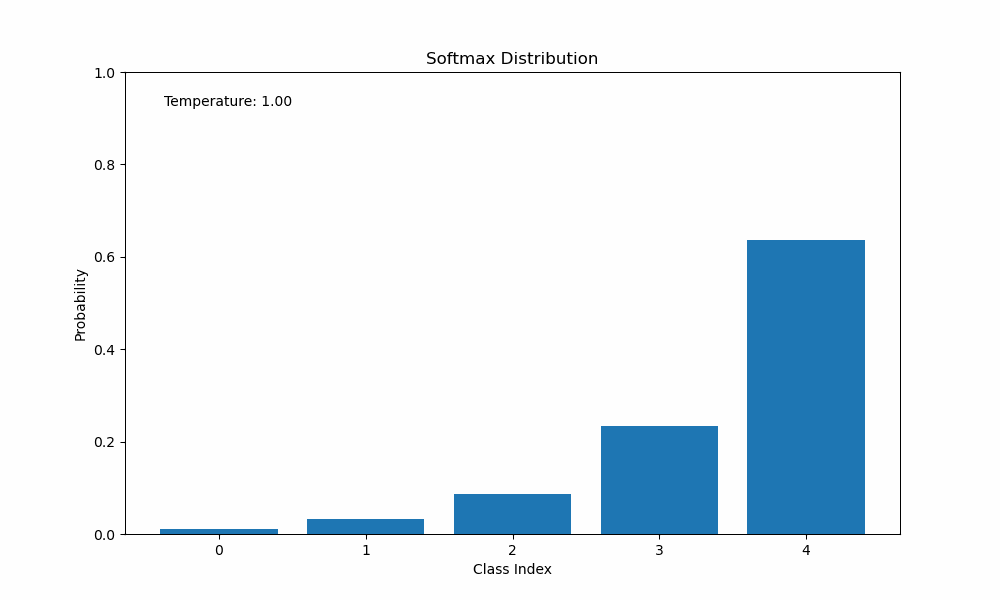

# Dark Knowledge
Knowledge distillation is a technique for model compression. It involves training small, powerful models using the information in pretrained large models and ensembles.

## TL;DR TL;DR:

Use big model predictions as soft targets for small model during training. 

## TL;DR:

The teacher leads the student down a better path by giving her advice learned during his own journey. In this way, the teacher's knowledge is passed down to the student. The student heeds this information, but also learns from her own experiences. 

## R:

#### Cross-entropy loss

In a typical classification problem, it is common to use the cross-entropy loss function

$$
\mathcal{L}_{\text{cross-entropy}} = L(\vec{t}, \vec{p}) = - \frac{1}{N}\sum_{n=1}^N \sum_{i=1}^d t_{ni} \log p_{ni}
$$

where $N$ is the number of samples, $d$ is the number of classes, $t_{ni}$  is the target probability for class $i$ of sample $n$, and $p_{ni}$ is the probability that the model assigned class $i$ of sample $n$. Note that $\sum_i t_{ni} = \sum_i p_{ni} = 1$ for valid probability distributions.

Usually each target vector $\vec{t}_n = (t_{n1}, t_{n1}, \ldots t_{nd})$ is one-hot encoded, so that the probability mass of each sample is concentrated in its actual class assignment (i.e., $t_{ni} = 1$ for the correct class and $t_{ni} = 0$ for all others). This is known as **hard assignment** and, as such, one-hot encoded vector labels are referred to as **hard targets**. However, this need not be the case.

We may instead allow for **fuzzy** or **soft assignment**, where the probability mass is spread out among the classes, representing varying levels of confidence of class membership. These labels then are referred to as **soft targets**.

#### Softmax 

The softmax function is a popular function in ml for creating probability distributions out of a series of numbers for many reasons that we will not go into here (stat mech among other things). All you need to know is that it converts a set of real numbers into a set of values between zero and one that sum to one -- a valid probability distribution ✅

$$
\text{softmax}(z_i / T) = \frac{\exp(z_i / T)}{\sum_j \exp(z_j / T)}
$$

In the argument of the function, $T$ is a parameter called temperature (stat mech) and $z_i$ is called a logit. Looking at the gif below, notice how when the temperature is low the distribution is peaky, emphasizing confidence in class assignment. As the temperature rises, the distribution smooths out and approaches a uniform distribution with high entropy. We'll come back to this point later.

#### Knowledge distillation

Here's where things get cool. Suppose that we've already trained a large model on our classification dataset. Then the probability distributions that it outputs provide useful information about each class. We can use these outputs to compress the knowledge from this large model into a smaller model.

Why? For starters, we assume that we were provided with labeled training data. This means that the large model, and any subsequent model, has a set of one-hot encoded vectors to train on. These **hard targets** provide information about the correct labels, but nothing about the incorrect labels. For example, consider a single sample where $t_c = 1$ and $T = 1$, 

$$
\begin{align*}
\mathcal{L}_{\text{cross-entropy}} = -\sum_{i=1}^d t_{i} \log p_{i} &= - \left[t_{1} \log p_{1} + t_{2} \log p_{2} + \ldots + t_{c} \log p_{c} + \ldots + t_{d} \log p_{d} \right] \\
&= - \left[0 \cdot \log p_{1} + 0 \cdot \log p_{2} + \ldots + 1 \cdot \log p_{c} + \ldots + 0 \cdot \log p_{d} \right] \\
&= - \log p_{c} 
\end{align*}
$$

Then during backprop,

$$
\begin{align*}
\nabla_w \mathcal{L}_{\text{cross-entropy}} &= 
\end{align*}
$$

> TODO :)

Cool. The point here is that a one-hot encoded **hard target** only produces a single term in the loss gradient corresponding to the output neuron of the correct class. Using **soft targets**, on the other hand, contains multiple terms from the output layer. In a dense network, each neuron in a layer is connected to each neuron in the preceding layer. In addition, the softmax function involves all logit neurons via the partition function. So even though the **hard target** setup begins backprop exclusively in the output neuron of the correct class, it will propagate updates through the other classes' logit neurons and throughout the rest of the network. At the end of the day, though, this primarily drives the model to increase the probability of the correct class.

In contrast, by using **soft targets**, the loss gradient will include more than just the correct output neuron term. This means that backprop will send signal through neurons of the correct and incorrect output neurons, leading to more updates in the output layer connections.

So we see that **soft targets** produce a more informative gradient than one-hot encoded **hard targets**. Because the gradient contains more output terms in it, 

